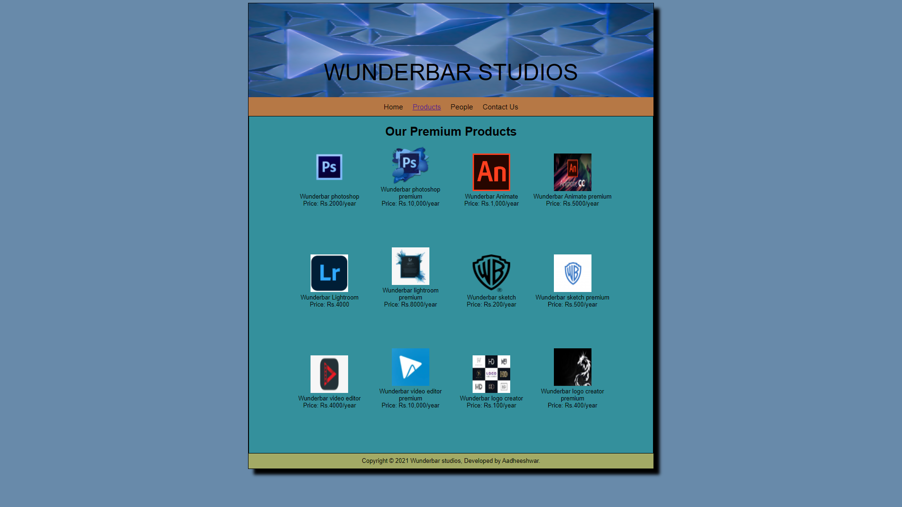

# Web Design for a Software Product Company

## AIM:

To design a static website for a software product company company.

## DESIGN STEPS:

### Step 1:

Requirement collection.

### Step 2:

Creating the layout using HTML and CSS.

### Step 3:

Updating the sample content.

### Step 4:

Choose the appropriate style and color scheme.

### Step 5:

Validate the layout in various browsers.

### Step 6:

Validate the HTML code.

### Step 6:

Publish the website in the given URL.

## PROGRAM :
home code:
~~~
<!DOCTYPE html>
<html lang="en">
 <head>
 <title>Wunderbar Studios</title>
 <link rel="stylesheet" href="./css/layout.css" />
 <link rel="icon" href="./img/icon.png" type="image/x-icon" />
 </head>
 <body>
 

 
WUNDERBAR STUDIOS.

 

 
<a href="/static/home.html">Home</a>

 
<a href="/static/products.html">Products</a>

 
<a>People</a>

 
<a>Contact Us</a>

 

 

 

 <h1>About Us</h1>
 
 

 Dynamic software offers a full collection of tools for animating and
 designing characters,  as well as a library of various brushes that
can
 designing characters, as well as a library of various brushes that can
 be further expanded with third-party brushes. It should also be noted
 that you can get Dynamic Animate free to study the basic functions or
you
 can choose an alternative program.
  
  
 Dynamic software allows you to breathe life into your characters, design
animated
 sketches and avatars, and make your eLearning and infographic projects
more dynamic
 and engaging. After you've finished your work, simply click the publish
button to share
 it on a plethora of platforms in your preferred format to reach as big
of an audience as possible.
 
 
 
 <ul>
 <li>Quality file compression.</li>
 <li>Allows creating animated elements.</li>
 <li>Cross-functionality.</li>
 <li>Can be integrated with other Dyno software.</li>
 <li>Lots of learning materials.</li>
 <li>Can be integrated with Photoshop and Illustrator.</li>
 <li>Automatic limb animations.</li>
 <li>Recording and editing takes.</li>
 <li>You need a webcam and microphone to use.</li>
 <li>Highly functional.</li>
 <li>Suitable for all types of animation.</li>
 <li>Has tutorials.</li>
 <li>Can be hard for beginners.</li>
 </ul>
 

 

 

 

 Copyright &#169; 2021 Wunderbar Studios, Developed by Aadheeshwar.A.
 

 

 </body>
</html>

~~~
product:
<!DOCTYPE html>
<html lang="en">
 <head>
 <title>Wunderbar Studios</title>
 <link rel="stylesheet" href="./css/layout.css" />
 <link rel="icon" href="./img/icon.png" type="image/x-icon" />
 </head>
 <body>
 

 
WUNDERBAR STUDIOS.

 

 
<a href="/static/home.html">Home</a>

 

 <a href="/static/products.html">Products</a>
 

 
<a>People</a>

 
<a>Contact Us</a>

 

 

 
 
 <h1>Our Products</h1>
 

 

 

 
 

 
Wunderbar photoshop

 
Price: Rs.10,000.00/per year 

 

 

 

 
 

 
Wunderbar photoshop premium

 
Price: Rs.20,000.00/per year 

 

 

 

 
 

 
Wunderbar Animate

 
Price: Rs.25,000.00/per year 

 

 

 

 
 

 
Wunderbar a Animate pemium

 
Price: Rs.40,000.00/per year 

 

 

 

 
 

 
Wunderbar Lightroom

 
Price: Rs.299/per year 

 

 

 

 
 

 
Wunderbar Lightroom premium

 
Price: Rs.499/per year 

 
 

<h3>Copyright &#169; 2021 WUNDERBAR STUDIOS, Developed by Aadheeshwar.<h3>
 

 

 </body>
</html>
~~~
People:
<!DOCTYPE html>
<html>
 <head>
 <title>WUNDERBAR STAFFS</title>
 <link rel="stylesheet" href="./css/layout.css" /> 
 <link rel="icon" href="./img/icon.png" type="image/x-icon" />
 </head>
 <body>
 
WUNDERBAR STUDIOS 

 

 
<a href="./home.html">Home</a>

 
<a href="./products.html">Products</a>

 
<a
href="./people.html">People</a>

 
<a href="./contacts.html">Contact Us</a>
 

 

 

 

 
 

 <h1><b><u><I>THE LEADING SPECIALIST OF OUR TEAM</u><b></b></I></h1>
 

 

 

 
 

 
CEO

 
Mr.Jack 

 

 

 

 
 

 
Product Manager

 
Mr.Harry  

 

 

 

 
 

 
VP of Marketing

 
Mr.Dhanush 

 

 

 

 
 

 
Project Manager

 
Mrs.Sheela 

 

 

 

 
 

 
Technical Lead

 
Mr. Fed

 

 

 

 
 

 
Senior Engineer

 
Mr. Ruther 

 

 
 

 
 
 

 

 Copyright &#169; 2021 Wunderbar Studios,Developed by Aadheeshwar.
 

 

 </body>
 </html>
 
 </body>
</html>
~~~
Contact:

<!DOCTYPE html>
<html>
 <head>
 <title>WUNDERBAR STUDIOS.</title>
 <link rel="stylesheet" href="./css/layout.css" />
 <link rel="icon" href="./img/icon.png" type="image/x-icon" />
 </head>
 <body>
 

 
WUNDERBAR STUDIOS 

 

 
<a href="./home.html">Home</a>

 
<a href="./products.html">Products</a>

 
<a href="./people.html">People</a>

 
<a href="./contacts.html">Contact Us</a>
 

 

 

 

 <h1><b><u>CONTACT US</u></b></h1>
 
<h4>For any queries Mail us  : wunderbarstudios@gmail.com</h4>

 
<h4>Call us at : +33 72360-6405</h4>

 
<h4>Our Main Branch is at :- 4-19 parkavenue line, opposite to
gianth mall,Eden garden,kolkata.</h4>

 

 

 

 

 Copyright &#169; 2021 WUNDERBAR STUDIOS, Developed by Aadheeshwar.
 

 

 </body>
 </html>
 
 </body>
</html>
~~~

## OUTPUT:

### Home Page:

### Product page:

### People Page:

### Contact Page:

## Result:

Thus a website is designed for the software product company and the HTML,CSS code are validated.
